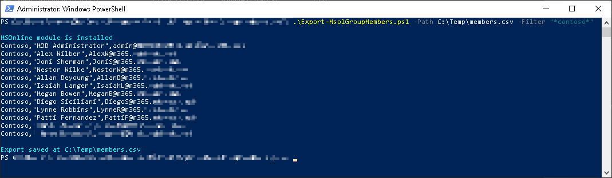
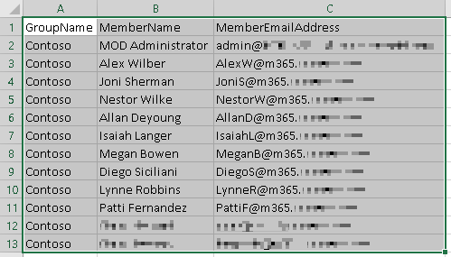

# Export-MsolGroupMembers.ps1
A script for M365 to export a CSV of distribution groups and their members.

Example 1: This will export all distribution groups with 'sales' somewhere in the name
```
   .\Export-MsolGroupMembers.ps1 -Path C:\Temp\members.csv -Filter "*sales*"
```
Example 2: This will export all distribution groups
```
   .\Export-MsolGroupMembers.ps1 -Path C:\Temp\members.csv -Filter "**"
```

The script will output the results to the terminal:



And the script will export to a CSV:


